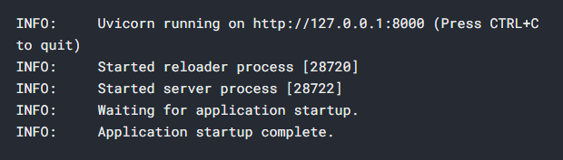

## Run SQL Account API

### Requirements
- Python 3.7+

### Install FastAPI
```console 
pip install fastapi
```

### Install Uvicorn server
```console 
pip install "uvicorn[standard]"
```

### Open PowerShell and run the following command line:
```console 
git clone https://github.com/Nb-Richard/sql_account_api
```

### Navigate to the cloned folder
```console 
cd sql_account_api
```

### Run the server with:
```console 
uvicorn sql_account_api:app --reload
```

<br/>

**The following output should be displayed, indicating the port on which the API is currently running.**  

